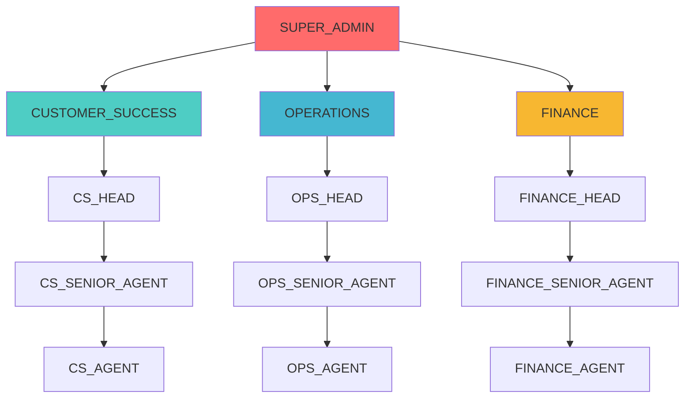
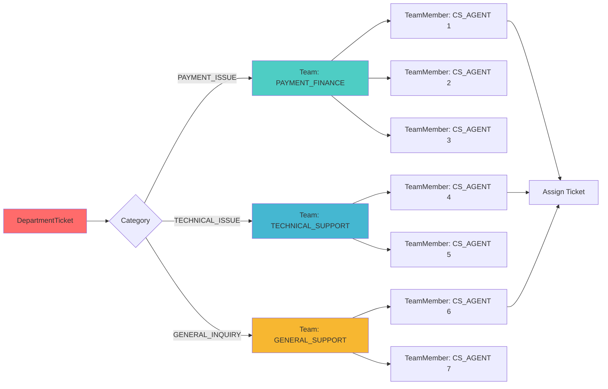
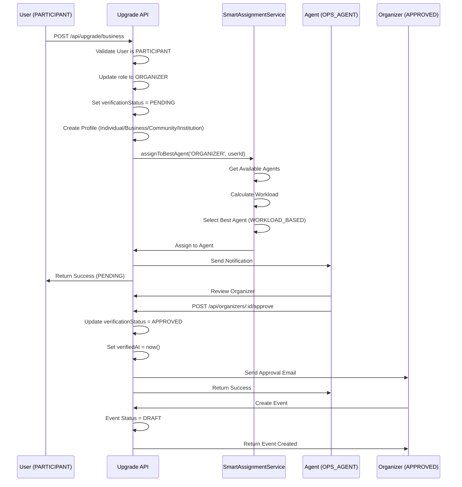
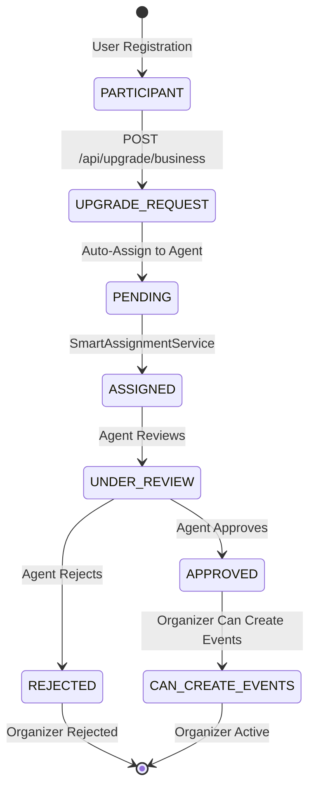
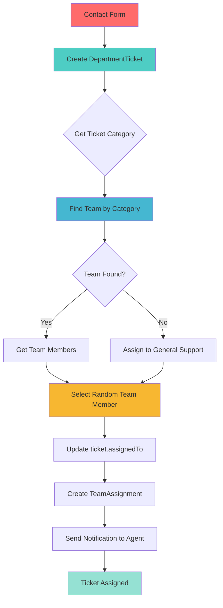
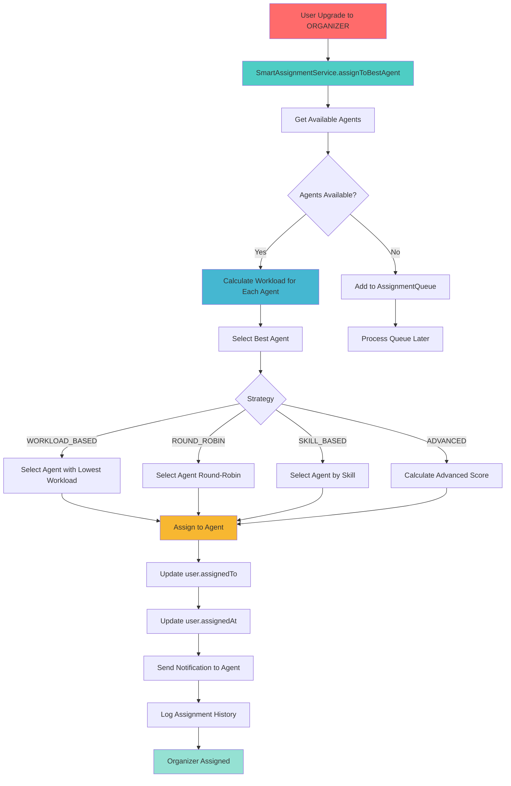
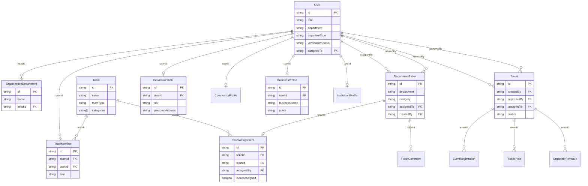
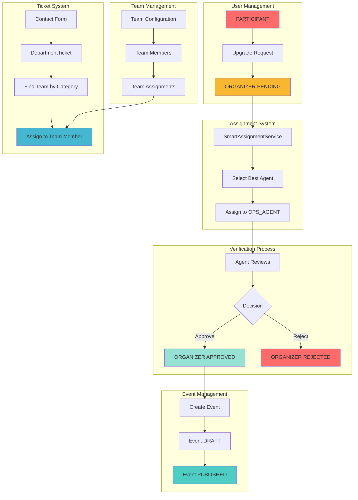
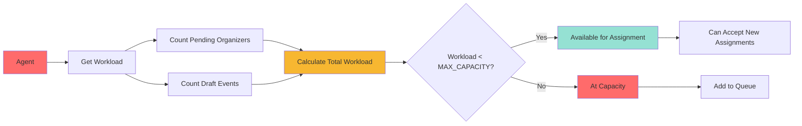
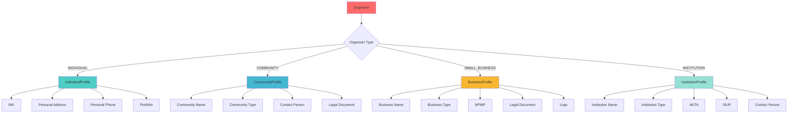

# Diagram Arsitektur: Department, Teams, dan Organizer

## 1. User Hierarchy dan Department Structure

## 2. Team Structure dan Auto-Assignment

## 3. Flow User Biasa ke Organizer

## 4. Organizer Verification Flow

## 5. Team Assignment Flow

## 6. Organizer Auto-Assignment Flow

## 7. Database Relationships

## 8. Complete System Flow

## 9. Agent Workload Management

## 10. Organizer Profile Types

